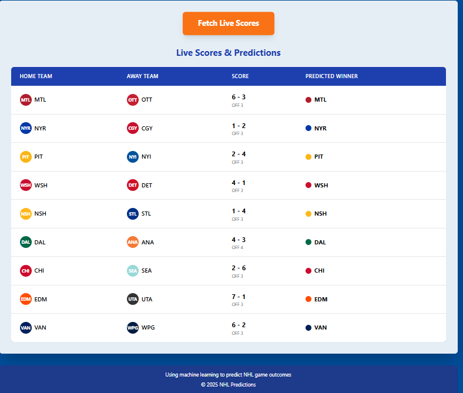

# NHL Prediction Application

This project is a web application that predicts NHL game outcomes using a trained Random Forest model. The app can either be run as a **Streamlit application** or through a **Flask app with a frontend**.

## Features

### 1. Live Prediction
- Fetches live NHL game data from the official NHL API.
- Preprocesses the data to match the trained model's features.
- Predicts the winner for ongoing games.
- Displays predictions alongside live game scores.

## Installation

### Prerequisites
- Python 3.8 or higher
- Pip package manager

### Setup Steps

1. Clone the repository:
   ```bash
   git clone <repository_url>
   cd <repository_name>
   ```

2. Install the required Python packages:
   ```bash
   pip install -r requirements.txt
   ```

3. Place the trained model file `best_rf_model.pkl` in the project directory.

4. Ensure the dataset (`sorted_merged_table.csv`) and any additional required files are in place if you plan to retrain the model.

5. **Optional**: If you want to retrain the model, use the provided `model.ipynb` notebook, which contains the model training code. The trained model will be saved as `best_rf_model.pkl` in the backend for later use.

## Usage

You have two options for running the application:

### Option 1: Run the Streamlit App (Direct)

1. Run the Streamlit app:
   ```bash
   streamlit run app.py
   ```

2. Navigate to the **Live Prediction** page from the sidebar.

3. Click the **Fetch Live Scores** button to retrieve ongoing NHL games.

4. View predicted winners based on the fetched data.

### Option 2: Run the Flask App + Frontend (Recommended for a Full Web Experience)

1. **Run the Flask Backend**:
   - First, ensure the Flask app (`app.py`) is running in the background:
     ```bash
     python app.py
     ```

2. **Frontend**:
   - Open the `index.html` file in your browser, which provides a user-friendly frontend.
   - This HTML file interacts with the Flask backend for live data fetching and displaying predictions.

### Model Training

- The model is trained using the `model.ipynb` Jupyter notebook.
- The trained model is saved as `best_rf_model.pkl` and used in the backend to predict game outcomes.
  
## Model Details

- **Algorithm**: Random Forest Classifier
- **Hyperparameter Tuning**: GridSearchCV was used to optimize hyperparameters like `n_estimators`, `max_depth`, and more.
- **Dataset**: The model was trained using NHL game data, including team performance statistics, game location, and other categorical features.
- **Target Variable**: `WL` (Win-Loss), derived from historical game results.

## Files

- `app.py`: The main Flask application (backend).
- `index.html`: The frontend file used with the Flask backend.
- `best_rf_model.pkl`: The pre-trained Random Forest model.
- `model.ipynb`: Jupyter notebook where the model is trained.
- `requirements.txt`: Python dependencies.
- `data/sorted_merged_table.csv` (Optional): Original dataset used for training.

## API Usage

The app utilizes the NHL API to fetch live scores. For more details on the API, visit the [NHL Developer Portal](https://developer.nhl.com/).

## How It Works

1. **Live Prediction**:
   - **Fetch Live Data**: Retrieves current game data via the NHL API.
   - **Preprocessing**: Transforms raw data into a format compatible with the trained model (e.g., one-hot encoding).
   - **Prediction**: Uses the trained Random Forest model to predict game winners.
   - **Display Results**: Outputs predictions alongside live game information.

2. **Flask & Frontend Workflow**:
   - The Flask app handles the backend logic, including fetching live data and making predictions.
   - The frontend (`index.html`) allows users to interact with the system easily, showing predictions and live scores.

## Limitations

- Predictions are only as accurate as the model and the data used for training.
- Model performance may degrade if team statistics or game dynamics change significantly.
- Relies on the NHL API's availability for live data.

## Future Enhancements

- Add support for historical game predictions.
- Incorporate additional features to improve model accuracy.
- Enhance the UI for a better user experience.

## License

This project is licensed under the MIT License. See the LICENSE file for details.

## Acknowledgments

- **NHL API** is used to provide real-time game data.
- **Scikit-learn** for the machine learning pipeline.

## Screenshots

### Streamlit App Example


### Flask + Frontend Example


